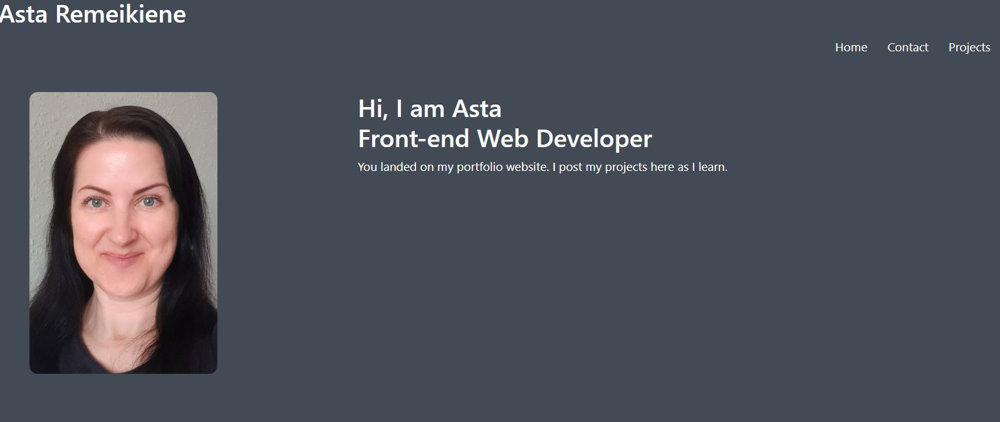
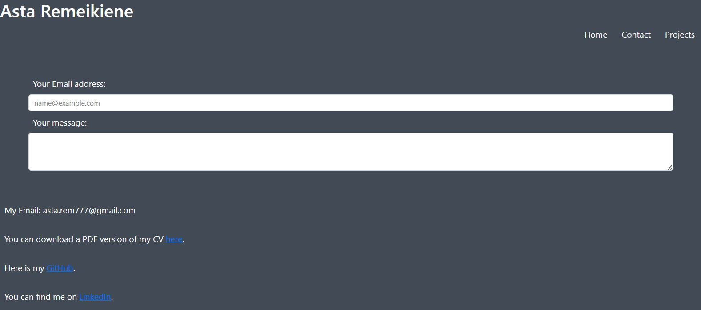
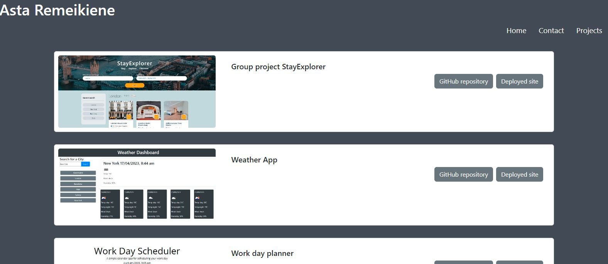
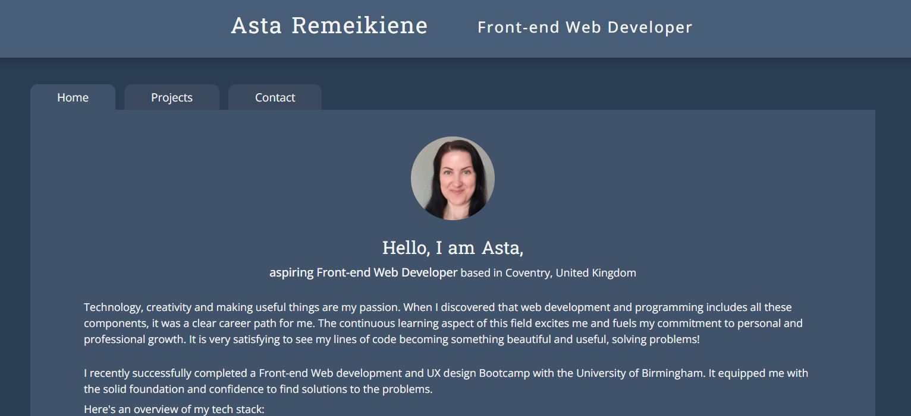
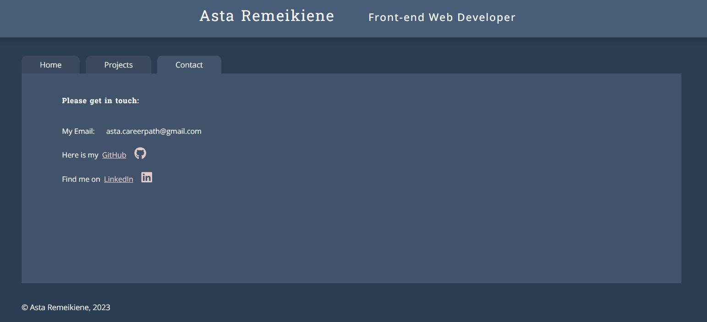
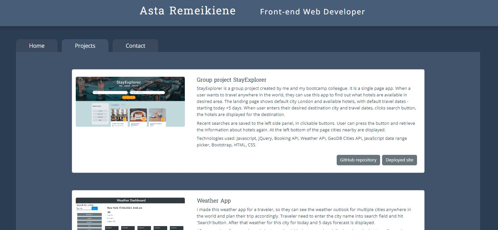

# React Portfolio

## Description 
### version 1.0

Here is a MVP for my React Portfolio(scroll down to see improved version 2.0 screenshots). I have used React to create this single page application. 

In the header of the page is my name and Navigation. I use React Router to navigate through the page. User lands to Home page:

When Contact link is clicked, my contact information is displayed, with the links to GitHub and LinkedIn:

When Projects link is clicked, it takes user to my project page.

Each project has an image, name and two buttons - one takes user to my GitHub repository for this project and another - to deployed site. 

This is working MVP site for my portfolio and it is work in progress. I am in the process of updating it with the better visual design solutions.

## Tools and technologies used:

- Javascript
- React
- Bootstrap
- CSS
- HTML

## Installation
There is no installation needed, please view this project in browser.
Link to deployed version 1 is [here on GitHub pages](https://astarem.github.io/react-portfolio/), version 2 is [deployed on Netlify](https://asta-rem.netlify.app/)

## Tests

N/a

### version 2.0
Home

Contact

Projects

